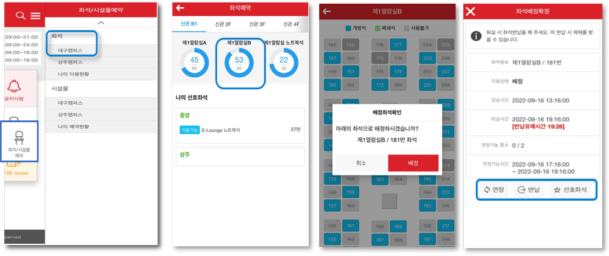
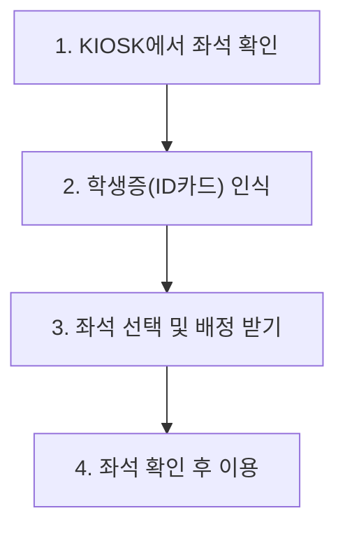
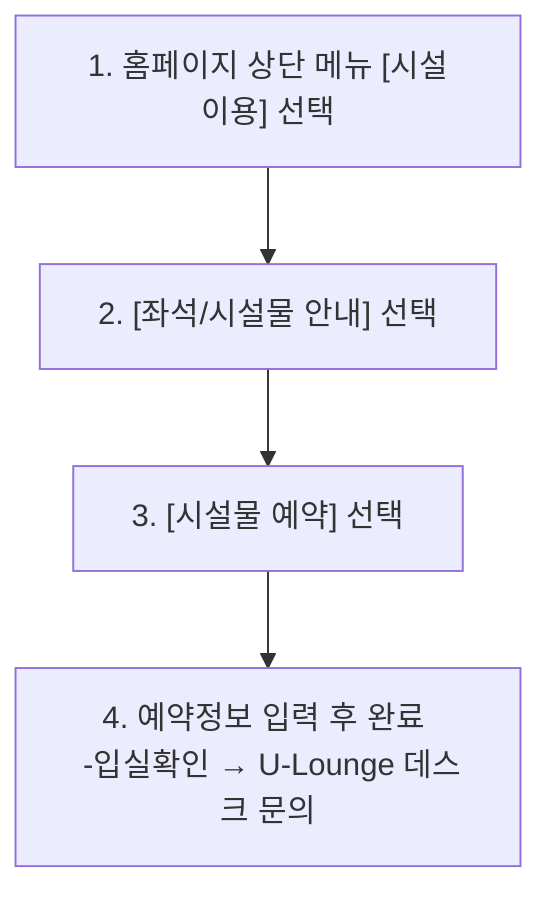

# 도서관 좌석 및 시설 예약 가이드

## 1. 좌석 예약 가이드

### 1-1. **필수** 확인사항

- 도서관 출입 Gate 인증 필수
  - 임시배정 (도서관 출입 전 15분 내) → **배정(도서관 출입 후)**
- 예약방법: 경북대학교 도서관 어플 또는 KIOSK (홈페이지 예약 불가)
  - KIOSK 위치: 구관 1층, 신관 1층, 신관 3층
- 예약시간 / 연장횟수 / 외출시간: **좌석별로 상이함**; 아래 내용 참조
- 열람실 좌석 및 시설물 등 타 시설물과 동시 이용 불가
- **이용 종료 후 반드시 *좌석 반납 필수* (이용시간 내)-> 미반납 시 제재 (1일)**

---

### 1-2. 좌석 위치 및 이용시간

| 구분 | 위치 | 이용가능시간 | 외출시간 | 예약방법 |
|------|------|-------------|----------|----------|
| 신관 | B1, 2-4층 열람실 | 6시간 (2회 연장)   **시험기간: 4시간 (4회 연장)** | 120분 | '경북대학교도서관'어플 또는 KIOSK (홈페이지 불가) |
| 신관 | 1층 S-Lounge 노트북석 | 2시간 (1회 연장)   최대 4시간 | 60분 | '경북대학교도서관'어플 또는 KIOSK (홈페이지 불가) |
| 구관 (CRETEC Zone) | 캐럴 A, B | 2시간 (1회 연장)   최대 4시간 | 30분 | '경북대학교도서관'어플 또는 KIOSK (홈페이지 불가) |
| 구관 (CRETEC Zone) | 정보검색존 1~7, 노트북존 A, B | 2시간 (1회 연장)   최대 4시간 | 30분 | '경북대학교도서관'어플 또는 KIOSK (홈페이지 불가) |

---

### 1-3. 일반회원 이용 안내
- 일반회원은 신관 열람실의 경우 제한적으로 이용 가능
  - 신관 열람실: 4층만 이용 가능 및 시험기간에는 이용 불가

---

### 1-4. 예약방법

#### 경북대학교 도서관 어플

#### KIOSK

---

### 1-5. 제재사항

#### 1일 이용 불가 조건
- 좌석 미반납
- 연장하지 않은 경우
- 외출시간 초과 (게이트 통과 기준).

※ 외출시간은 좌석 이용시간에 포함됨  
예) 좌석 반납시간: 16시 → 15시에 외출하더라도 반납시간은 동일하게 16시

---

## 2. 시설물 예약 가이드

### 2-1. 필수 확인사항

- 최소 수용인원(동반 이용) 충족 시 예약 가능; 최소 인원은 예약 화면에서 확인가능
- 예약방법: 경북대학교 도서관 어플 또는 홈페이지 (KIOSK 이용불가)
- 예약시간: **하루 1회, 최소 30분 ~ 최대 3시간 (연장불가)**
- 예약가능일: 예약일 5일 전부터 가능

---

### 2-2. **입실 확인 방법**

#### 2-2-1. 구관 1층, 신관 1층 (키락)

1. 키락 화면 하단 QR코드 버튼 클릭  
2. 카메라 모드 전환 후, 모바일 학생증(QR코드) 인식  
   - **동반 이용자 모두 QR 인식 → 미 이행 시 예약부도로 제재**  
3. **‘조회되었습니다’ 문구 확인 시 정상 인식**  
4. 예약시간 20분 전 ~ 예약시간 후 20분 내 가능  

---

#### 2-2-2. 구관 3층, 신관 24층 (어플)

1. 어플: [좌석/시설물예약] → [나의 시설예약]에서 **입실 확인**  
   - **동반 이용자 모두 QR 인식 → 미 이행 시 예약부도로 제재**  
2. 예약시간 20분 전 ~ 예약시간 후 20분 내 가능  

---

### 2-3. 특이사항

- 신관 1층 S-Lounge Study Room 7번: 장애학생 전용 공간, 1인 이상 예약 가능
  - 입실확인 미 이행 시 예약부도 제재 부여
  - 무단 사용 시 이용자 준수사항 위반에 따른 제재 부여

---

### 2-4. 시설물 위치 및 이용시간

| 구분 | 위치(시설물명) | 예약가능일 | 이용가능시간 | 예약방법 |
|------|----------------|------------|---------------|----------|
| 신관 | 1층4층 (S-Lounge, Study Room) | 예약일 5일 전부터 가능 | 최소 30분 ~ 최대 3시간 (연장불가) | 어플 또는 홈페이지 (KIOSK 불가) |
| 구관 | 1층 U-Lounge (Smart Learning Room) | 예약일 5일 전부터 가능 | 최소 30분 ~ 최대 3시간 (연장불가) | 어플 또는 홈페이지 (KIOSK 불가) |
| 구관 | 1층 CRETEC Zone (Study Room) | 예약일 5일 전부터 가능 | 최소 30분 ~ 최대 3시간 (연장불가) | 어플 또는 홈페이지 (KIOSK 불가)|
| 구관 | 3층 스터디 라운지 (Study Room) | 예약일 5일 전부터 가능 | 최소 30분 ~ 최대 3시간 (연장불가) | 어플 또는 홈페이지 (KIOSK 불가)|
| 구관 | 3층 중앙홀 (1인 Study Room) | 예약일 5일 전부터 가능 | 최소 30분 ~ 최대 3시간 (연장불가) | 어플 또는 홈페이지 (KIOSK 불가)|

---

### 2-5. 예약방법

### 경북대학교 도서관 어플
- 어플을 통해 시설물 예약 가능

---

#### 도서관 홈페이지

  

---

### 2-6. 제재사항

- 입실확인 미 이행 시 ‘예약부도’ 제재 (5일)
  - 적용 시간: 예약시간 전/후 20분 이내
  - 동반 예약자 모두 실시 필수

---
