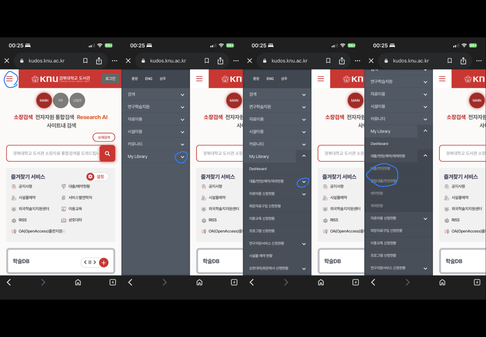

# 第二 : 도서 제출 및 반납 수칙

## 1. 도서 제출 및 반납 기한
경북대학교 도서관의 도서 **제출 및 반납 기한**은 다음과 같다.

|    구분    |    평일    |    토요일    | 
|:-----|:-----|:-----|
|    **학기중**    |    09:00 ~ 21:00    |    09:00 ~ 17:00    |
|    **방학중**    |    09:00 ~ 18:00    |    09:00 ~ 17:00    |

### 그 외 도서 제출
- **자동반납기**는 업무시간 외에도 가능하다.

## 2. 대출 권수 및 기간
- 경북대학교는 신분에 따라 대출 권수 및 기한이 상이하다.

|신분|권수|기간(일)|
|:-----|:-----|:-----|
|학부 재학생|10|14
|대학원생|20|30|
|교수/강사|50|180|
|명예교수|30|90|
|자체직원|5|14|
|휴학생|5|14|
|동문회원|5|14|
|일반회원|5|14|
|특별회원|10|14|
|우대회원|10|30|
|직원,조교,연구원,부속학교 교원|20|30|

## 3. 대출 관련 **세세한 정보**

### 대출 방법
- 도서관 홈페이지에서 자료 검색 후, 직접 서가에서 자료를 찾아 무인대출기가 있는 1층 및 2층 또는 대출실에서 대출한다.
- 본인의 학생증으로만 대출할 수 있다.
- 대리대출은 **불가**하다.
  * **모바일 이용증**(도서관 어플), 학생증(실물카드, 크누피아 어플)
- 한 사람이 동일 도서를 2권 이상 대출 불가

### 대출 기한
- 베스트셀러 도서(대출기간 : 14일, 연장불가)
- 지정도서(대출기간 : 3일 그리고 연장불가)

## 4. 자료반납 **세세한 정보**

### 반납 위치
- 반납예정일 내에 대출실 또는 무인반납기에 반납
* **무인반납기 위치** : 신관1층, 구관1~2층

### 신분에 따른 반납 일정
- 휴학하거나 제적을 한다면 대출한 자료를 모두 반납해야한다.
- 만약 졸업예정자라면, 졸업식 예정일 약 2주 전까지는 대출한 자료를 모두 반납해야한다.

# 延長/延滞

## 1. 연장/연체
- 연장 신청일을 기준으로 본인의 대출 기간만큼 연장됨(반납예정일 **7일 전**부터 연장 가능)
* 연장 신청 링크 (https://kudos.knu.ac.kr/pages/index.htm)
* 연장 신청 방법 
- 한 책당 2회까지 연장가능
- 예약된 자료는 연장 불가
- 베스트셀러 코너의 도서 및 지정도서는 연장 불가

### 연체자료에 대한 제제
- 책당 연체일수에 해당하는 기간동안 대출중지
- 연체책수×연체일수×10분의 근로봉사

## 2. 분실 및 훼손
- 도서관자료를 분실 또는 훼손한 경우 동일 자료로 변상하여야 함.
- 동일자료를 구할 수 없을 경우 유사한 주제의 최신자료(출판년도가 분실도서보다 최신년도) 중 면수가 더 많은 책으로 변상

## 3. 자료 무단유출등의 제제
* 도서관 시설의 훼손, 파괴, 절도, 자료의 무단반출 및 자료를 찢거나 더럽힐 경우 다음의 제제를 받을 수 있음.
>> 시가의 **2배**를 변상(실수나 고의 등 모두 포함)
>> **1년간** 자료 대출 중지, 자술서 제출, 학과장/본가에 통보, 도서관 게시판에 공고 의한 처벌
